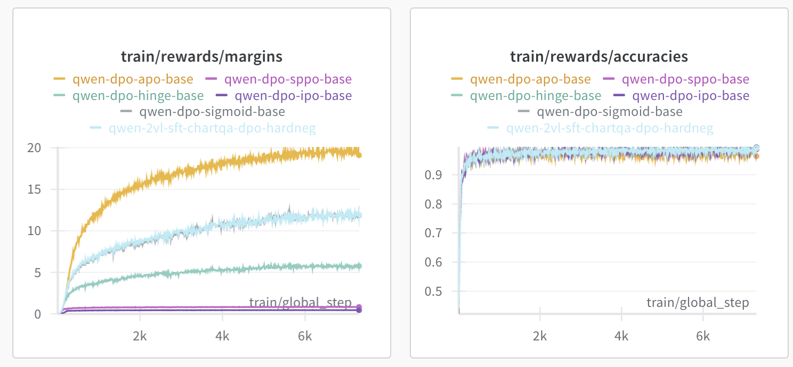

# ChartRL: Improving Chart understanding in VLMs 

Repo for RL post-training on Chart data. We present a small 3 billion chart understanding model which outputs answers AND rationales with no fine-tuning or distilling reasoning traces from larger frontier LLMs. Currently the models are based on Qwen2.5VL-3billion.

The design hinges on training VLMs using GRPO with verifiable rewards.
The training data is sampled from train sets of - ChartQA, PlotQA, FigQA and ChartFC.

Huge thanks to the team at Morgan Stanley for their support.

## Main Benchmark Results

| Model (≈ 2‑3 B params)     | Strategy        | ChartQA&nbsp;(RA) | Aug&nbsp;(RA) | Human&nbsp;(RA) | Notes                     |
|----------------------------|-----------------|------------------|---------------|-----------------|---------------------------|
| Qwen‑2.5 VL‑Instruct       | Direct          | 82.00            | 92.64         | 71.36           | No rationales             |
| Qwen‑2.5 VL‑Instruct – SFT | Direct          | —                | —             | —               | No rationales             |
| Qwen‑2.5 VL‑Instruct       | CoT             | 73.12            | 93.44         | 52.80           | Very bad rationales       |
| Qwen‑2.5 VL‑Instruct – SFT - rationales from QwenVL72b | CoT | 85.96  | 93.60  | 78.32              | **Solid rationales**             |
| **Qwen‑2.5 VL‑Instruct (Ours - naive)**   | **GRPO**        | **82.12**        | **93.28**     | **70.96**       | **Solid rationales**      | \
| **Qwen‑2.5 VL‑Instruct (Ours)**   | **GRPO**        | **82.92**        | **94.40**     | **72.16**       | **Solid rationales**      | \
| ChartInstruct-Flan-T5-XL       | Direct          | 72.00            | 93.84         | 50.16           | No rationales  
| ChartAssistant-S (13b)  | CoT        | 79.9        | 93.90     | 65.90       | **Solid rationales**      |
| ChartGemma   | CoT        | 80.16        | 90.80     | 69.52       | **Solid rationales**      |

Our approach boosts performance on human annotated splits of ChartQA 

## Loss ablations for DPO (old work not relevant now)

| Model          | Loss       | RA    |
|----------------|------------|-------|
| Qwen-2VL-Base  | –          | 71.48 |
|                | Sigmoid    | 71.92 |
|                | IPO        | 61.28 |
|                | Sppo_hard  | 71.88 |
|                | Hinge      | **72.04** |
|                | Apo Zero   | **72.04** |

